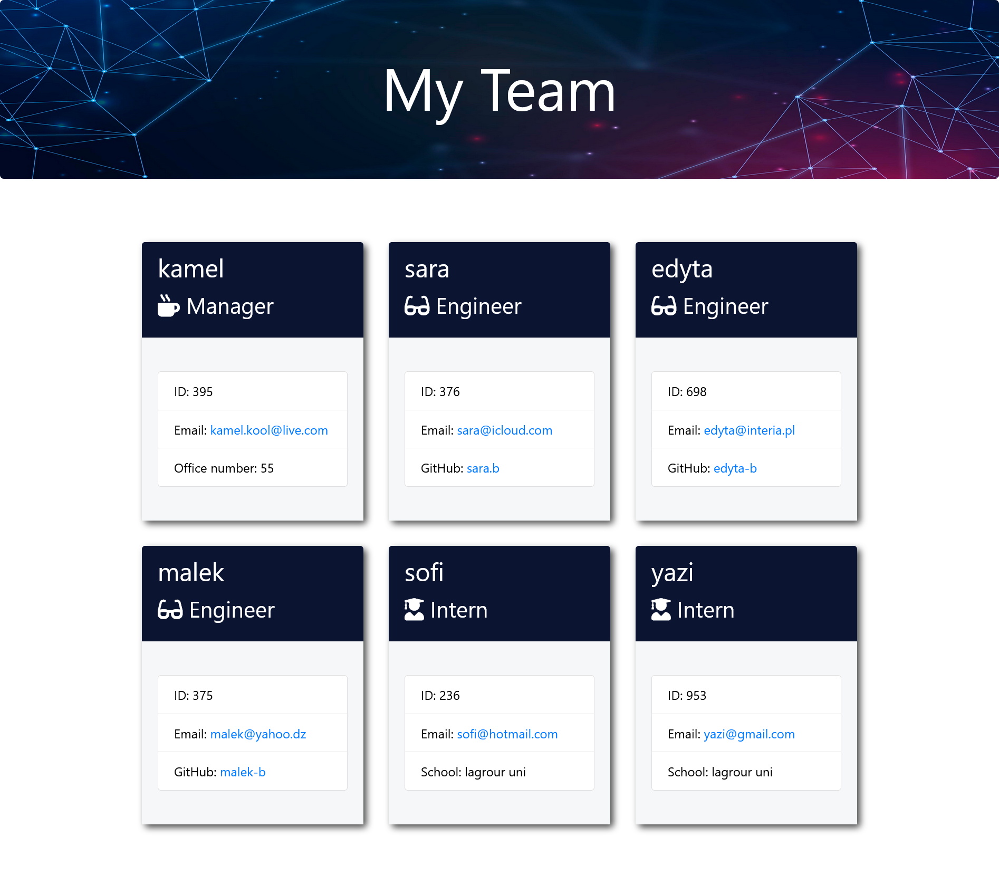

# My-Team-Generator

## Description

This application is designed to function as a Team generator. The user utilizes a CLI (terminal or gitbash) to create a team HTML file. The team is a software engineering one, composed of a Manager and other team members who can be engineers of interns. The user is prompted to fill in the details of the teams members in the CLI and a "team" HTML file will be created within this repository.

## Table of Contents

- [Installation](#installation)
- [Usage](#usage)
- [Link to deployed app](#link-to-deployed-app)
- [License](#license)
- [Credits](#credits)
- [Tests](#tests)
- [Questions](#questions)

## Installation

In order to install this project, you must login to GitHub and go to https://github.com/kamel-beloula/ReadMe-Generator. Once there you will click on the green button that says clone or download. You will be given choices on how to download: using the ssh/html key or downloading the zip file.

Using SSH/HTML Key: You will copy the link shown and open up either terminal (mac: pre-installed) or gitbash (pc: must be installed). Once the application is open, you will type git clone paste url here. Once you have cloned the git readme-generator repo, cd into the repo and type "open ." to open the folder which contains all files used for the project.

Using Download ZIP: Click on Download Zip. Locate the file and double click it to unzip the file. Locate the unzipped folder and and open it. All the files for the project will be within this folder.

## Usage

In order to use this application. You must cd into the My-team-genreator respository via your CLI. Once there, you will need to type in `npm install` in order to install "*inquirer*". If inquirer does not get installed, the prompts will not work. After that is installed, you type in `node index.js` to initialize the questions. Answer the following prompts and the "*team*" file should be created in the "*output*" folder.

## Link to the deployed app

Live website [here](https://kamel-beloula.github.io/My-Team-Generator/). Since there is no index.html, the link displays the ReadMe file.

## Screenshot
Team.html Sample:

## License

Copyright (c) [2023][kamel.beloula]
The license is MIT License.
Read more about it at https://opensource.org/licenses/MIT.

## Credits

Used classroom activities for code inspiration (edX). 
https://www.freecodecamp.org/news/how-to-format-code-in-markdown/

## Tests

In order to test the code, you must make sure you have installed "*jest*". If you typed in `npm install` above, it should have downloaded both inquirer (for the prompts) and jest (for tests). You must cd into the my-team-generator repository via your CLI. Once there you will type in 'npm test'. The tests will initialize and will tell you if the tests have passed or failed. If jest did not get installed properly type in `npm install jest` to try and download it. Tests pass screenshot:

## Questions

If you have any additional questions please contact me at 
  eMail: kamel.solo@live.com 
  GitHub: https://github.com/kamel-beloula